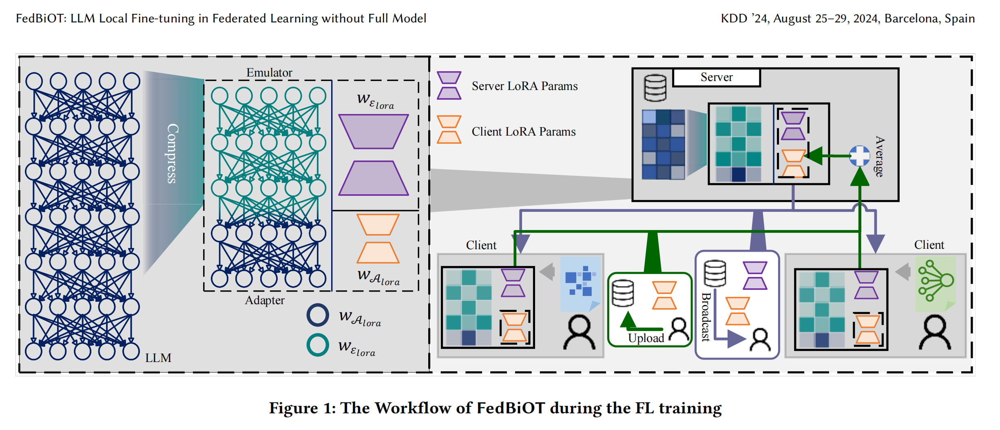

# FedBiOT 论文复现记录

> 复现 FedBiOT: LLM Local Fine-tuning in Federated Learning without Full Model

## 环境信息

- **GPU**: NVIDIA GPU (CUDA 12.8.0)
- **Python**: 3.9
- **PyTorch**: 2.1.0+cu121
- **模型**: GPT-2 (基础测试) / LLaMA-2-7B (论文完整复现)

---

## 1. FedBiOT 核心原理

### 1.1 传统联邦学习的问题

在标准联邦学习（如 FedAvg）中：
- **客户端需要完整模型**：每个客户端必须下载完整的 LLM（如 LLaMA-2-7B 有 70 亿参数）
- **通信成本高**：每轮上传下载几十亿参数
- **计算成本高**：客户端需要训练整个模型

### 1.2 FedBiOT 的创新解决方案

FedBiOT 提出 **"Offsite-tuning"** 框架，核心思想：

```
┌─────────────────────────────────────────────────────────┐
│                      Server (LLM Owner)                  │
│  ┌─────────────────┐        ┌─────────────────────┐     │
│  │  Full LLM       │        │  Emulator (压缩模型) │     │
│  │  (LLaMA-2-7B)   │───────▶│  (dropout 20%层)    │     │
│  │  70亿参数       │        │  约 50% 参数量       │     │
│  └─────────────────┘        └─────────────────────┘     │
│           │                           │                 │
│           │    知识蒸馏 (每轮对齐)      │                 │
│           │◀──────────────────────────┘                 │
└───────────┼─────────────────────────────────────────────┘
            │
            │ 只传递 Emulator + Adapter 参数
            ▼
┌─────────────────────────────────────────────────────────┐
│                    Client (数据拥有者)                   │
│  ┌─────────────────┐        ┌─────────────────────┐     │
│  │  Emulator       │        │  Adapter (LoRA)     │     │
│  │  (冻结，不训练)  │───────▶│  (可训练，少量参数)  │     │
│  │  模拟原始模型    │        │  r=8, 约 0.2% 参数   │     │
│  └─────────────────┘        └─────────────────────┘     │
│           │                           │                 │
│           │      本地数据训练          │                 │
│           └──────────────────────────▶│                 │
│                                       │                 │
│  输出 = Emulator(Adapter(输入))        │                 │
│  只更新 Adapter 的 LoRA 参数           │                 │
└─────────────────────────────────────────────────────────┘
```


### 1.3 双层优化机制

FedBiOT 的核心是 **Bi-level Optimization（双层优化）**：

| 层级 | 位置 | 优化对象 | 目的 | 数据 |
|:---|:---|:---|:---|:---|
| **上层** | Server | Emulator | 保持与原始 LLM 的输出一致 | 公共数据 (public dataset) |
| **下层** | Client | Adapter | 学习下游任务的领域知识 | 本地私有数据 (local data) |

**为什么这样设计？**
- **Emulator 对齐**：确保压缩后的模型不会偏离原始模型太远
- **Adapter 专门化**：让客户端用自己的数据微调，同时保护隐私
- **解耦训练**：Server 和 Client 可以异步优化，不需要同时训练

---

## 2. 环境配置

### 2.1 安装 Miniconda

```bash
# 下载并安装
cd ~
wget https://repo.anaconda.com/miniconda/Miniconda3-latest-Linux-x86_64.sh -O miniconda.sh
bash miniconda.sh -b -p ~/miniconda3

# 激活
source ~/miniconda3/bin/activate

# 配置清华镜像
conda config --add channels https://mirrors.tuna.tsinghua.edu.cn/anaconda/pkgs/free/
conda config --add channels https://mirrors.tuna.tsinghua.edu.cn/anaconda/pkgs/main/
conda config --set show_channel_urls yes
```

### 2.2 创建 Conda 环境

```bash
conda create -n fedbiot python=3.9 -y
conda activate fedbiot
```

### 2.3 安装 PyTorch

```bash
pip install torch==2.1.0 torchvision==0.16.0 torchaudio==2.1.0 --index-url https://download.pytorch.org/whl/cu121
```

### 2.4 安装依赖

```bash
pip install transformers==4.35.2 accelerate==0.24.1 peft==0.6.2 datasets -i https://pypi.tuna.tsinghua.edu.cn/simple
```

### 2.5 克隆 FedBiOT 代码

```bash
cd ~
git clone https://github.com/HarliWu/FedBiOT.git
cd FedBiOT
pip install -e . -i https://pypi.tuna.tsinghua.edu.cn/simple
```

---

## 3. 数据准备

### 3.1 下载 GSM8K 数据集

在**登录节点**（有网）执行：

```bash
mkdir -p ~/FedBiOT/data
cd ~/FedBiOT/data

# 下载训练集和测试集
wget https://raw.githubusercontent.com/openai/grade-school-math/3101c7d5072418e28b9008a6636bde82a006892c/grade_school_math/data/train.jsonl -O gsm8k_train.jsonl
wget https://raw.githubusercontent.com/openai/grade-school-math/3101c7d5072418e28b9008a6636bde82a006892c/grade_school_math/data/test.jsonl -O gsm8k_test.jsonl
```

### 3.2 下载 GPT-2 模型（离线使用）

```bash
export HF_HOME=/home/user/models
mkdir -p $HF_HOME

python3 -c "
from transformers import AutoModelForCausalLM, AutoTokenizer
tokenizer = AutoTokenizer.from_pretrained('gpt2')
model = AutoModelForCausalLM.from_pretrained('gpt2')
print('GPT-2 downloaded!')
"
```

---

## 4. 关键代码修改详解

### 4.1 修改 dataloader.py

**文件**: `federatedscope/llm/dataloader/dataloader.py`

#### 修改 1: 添加 `local_files_only=True`

```python
# 第 83-89 行
tokenizer = AutoTokenizer.from_pretrained(
    model_name,
    cache_dir=cache_dir,
    model_max_length=tok_len,
    padding_side="right",
    use_fast=False,
    local_files_only=True,  # 【添加】
)
```

**为什么需要改？**
- **问题**：计算节点没有外网，无法从 HuggingFace 下载模型
- **原理**：`local_files_only=True` 强制 Transformers 只从本地缓存加载，不尝试联网
- **不改的后果**：报错 `Cannot access gated repo` 或 `ConnectionError`

#### 修改 2: `LLMDataCollator` 返回元组

```python
# 第 38 行
return (input_ids, labels)  # 【修改】原来是 dict
```

**为什么需要改？**
- **问题**：FedBiOT 的 `llmtrainer` 和底层 `torch_trainer` 对数据格式的要求不一致
- **原理**：
  - 底层 `_hook_on_batch_forward` 用 `x, label = [_.to(ctx.device) for _ in ctx.data_batch]` 解包
  - 如果 `ctx.data_batch` 是字典，迭代会得到字符串 keys（`'input_ids'`, `'labels'`），而不是张量
  - 字符串没有 `.to()` 方法，导致 `AttributeError: 'str' object has no attribute 'to'`
- **不改的后果**：`AttributeError` 或 `ValueError: too many values to unpack`

---

### 4.2 修改 model_builder.py

**文件**: `federatedscope/llm/model/model_builder.py`

```python
# 第 14 行和第 23 行
return AutoModelForCausalLM.from_pretrained(
    model_name, 
    local_files_only=True,  # 【添加】
    **kwargs
)
```

**为什么需要改？**
- **问题**：同 4.1，模型加载时也会尝试联网下载
- **原理**：确保模型从本地缓存加载
- **不改的后果**：无法加载模型，报错 `OSError: We couldn't connect to 'https://huggingface.co'`

---

### 4.3 修改 llm_dataset.py

**文件**: `federatedscope/llm/dataset/llm_dataset.py`

#### 修改 1: `__init__` 中添加张量转换

```python
# 在 data_dict = self.preprocess(...) 之后
self.input_ids = data_dict["input_ids"]
self.labels = data_dict["labels"]

# 【添加】转换为 PyTorch 张量
import torch
self.input_ids = [torch.tensor(x) for x in self.input_ids]
self.labels = [torch.tensor(x) for x in self.labels]
```

**为什么需要改？**
- **问题**：`preprocess` 返回的是 Python 列表，不是 PyTorch 张量
- **原理**：
  - PyTorch DataLoader 需要将数据转换为张量才能进行 GPU 计算
  - `pad_sequence` 等操作要求输入是张量列表
- **不改的后果**：`TypeError` 或无法进行 batch 拼接

#### 修改 2: `__getitem__` 返回字典

```python
def __getitem__(self, i):
    return {
        'input_ids': self.input_ids[i],
        'labels': self.labels[i]
    }
```

**为什么需要改？**
- **问题**：`LLMDataCollator` 期望用字符串 key 访问数据（`instance['input_ids']`）
- **原理**：保持与 HuggingFace 数据集格式一致，便于后续处理
- **不改的后果**：`KeyError` 或 `TypeError: tuple indices must be integers or slices, not str`

---

### 4.4 修改 adapter_builder.py

**文件**: `federatedscope/llm/model/adapter_builder.py`

```python
def forward(self, *args, **kwargs):
    # 【添加】提取参数，确保 disable_adapter 是布尔值
    disable_adapter = kwargs.pop('disable_adapter', False)
    if isinstance(disable_adapter, torch.Tensor):
        disable_adapter = disable_adapter.bool().item() if disable_adapter.numel() == 1 else False
    
    # 执行模型
    if isinstance(self.model, PeftModel) and disable_adapter:
        with self.model.disable_adapter():
            output = self.model(*args, **kwargs)
    else:
        output = self.model.forward(*args, **kwargs)
    
    # 【添加】提取 logits
    if hasattr(output, 'logits'):
        return output.logits
    return output
```

**为什么需要改？**

#### 原因 1: `disable_adapter` 类型检查

- **问题**：FedBiOT 内部调用时，`disable_adapter` 可能被错误地传递为张量
- **原理**：
  - `PeftModel` 的 `disable_adapter()` 上下文管理器需要布尔值
  - 如果传入张量，`if isinstance(self.model, PeftModel) and disable_adapter` 会触发 `RuntimeError: Boolean value of Tensor with more than one value is ambiguous`
- **不改的后果**：`RuntimeError` 无法前向传播

#### 原因 2: 提取 logits

- **问题**：HuggingFace 模型返回的是 `CausalLMOutputWithCrossAttentions` 对象，不是纯张量
- **原理**：
  - 训练器（trainer）期望得到 logits 张量来计算损失
  - 如果返回对象，损失函数（如 MSELoss）会报错 `AttributeError: 'CausalLMOutputWithCrossAttentions' object has no attribute 'size'`
- **不改的后果**：无法计算损失，训练无法开始

---

### 4.5 修改 trainer.py

**文件**: `federatedscope/llm/trainer/trainer.py`

```python
def _hook_on_batch_forward(self, ctx):
    import torch
    from torch.nn import CrossEntropyLoss
    
    # 【添加】初始化标志位，防止 backward 报错
    ctx.skip_this_batch = False
    
    # 【修改】兼容元组和字典格式的数据
    if isinstance(ctx.data_batch, dict):
        input_ids = ctx.data_batch['input_ids'].to(ctx.device)
        labels = ctx.data_batch['labels'].to(ctx.device)
    else:
        input_ids = ctx.data_batch[0].to(ctx.device)
        labels = ctx.data_batch[1].to(ctx.device)
    
    # 模型前向传播
    outputs = ctx.model(input_ids, labels=labels)
    logits = outputs.logits if hasattr(outputs, 'logits') else outputs
    
    # 【核心修改】计算 LLM 专用的 CrossEntropy Loss
    # 错位预测（Next Token Prediction）：用当前词预测下一个词
    shift_logits = logits[..., :-1, :].contiguous()  # 去掉最后一个词的预测
    shift_labels = labels[..., 1:].contiguous()      # 去掉第一个词的标签
    
    loss_fct = CrossEntropyLoss()
    ctx.loss_batch = loss_fct(
        shift_logits.view(-1, shift_logits.size(-1)),  # [batch*seq_len, vocab_size]
        shift_labels.view(-1)                           # [batch*seq_len]
    )
    
    ctx.batch_size = len(labels)
```

**为什么需要改？**

#### 原因 1: `skip_this_batch` 初始化

- **问题**：FedBiOT 的 trainer 框架要求设置 `ctx.skip_this_batch` 标志位
- **原理**：用于处理异常 batch（如 OOM），如果不初始化，backward 时会报 `AttributeError`
- **不改的后果**：`AttributeError: Attribute skip_this_batch is not found`

#### 原因 2: 数据格式兼容

- **问题**：我们修改了 `LLMDataCollator` 返回元组，但框架其他部分可能期望字典
- **原理**：通过 `isinstance` 检查，同时支持两种格式
- **不改的后果**：`TypeError` 或 `KeyError`

#### 原因 3: 错位预测（Next Token Prediction）

- **问题**：语言模型的训练目标是预测下一个词，不是当前词
- **原理**：
  - 输入：`[我, 喜欢, 深度, 学习]` 
  - 标签：`[喜欢, 深度, 学习, <eos>]`
  - 用 "我" 预测 "喜欢"，用 "喜欢" 预测 "深度"，以此类推
  - `shift_logits[..., :-1, :]`：去掉最后一个预测（因为没有下一个词）
  - `shift_labels[..., 1:]`：去掉第一个词（因为第一个词没有上一个词预测它）
- **不改的后果**：训练目标错误，模型学不到正确的语言模式

#### 原因 4: CrossEntropyLoss 代替 MSELoss

- **问题**：FedBiOT 默认使用 MSELoss（均方误差），这是用于回归任务的
- **原理**：
  - 语言模型是分类任务（从 vocab_size 个词中选一个）
  - CrossEntropyLoss 是分类任务的标准损失函数
  - MSELoss 会报错 `RuntimeError: The size of tensor a (50258) must match the size of tensor b (141)`，因为试图把 logits [batch, seq_len, vocab_size] and labels [batch, seq_len] 直接相减
- **不改的后果**：维度不匹配错误，无法计算损失

---

## 5. 配置文件

### 5.1 基础版本 (GPT-2 + LoRA)

**文件**: `fedbiot_configs/basic.yaml`

```yaml
use_gpu: True
device: 0
federate:
  mode: standalone
  total_round_num: 5
  client_num: 3
data:
  root: data/
  type: gsm8k@llm
  splits: [0.8, 0.1, 0.1]
  splitter: iid
llm:
  tok_len: 650
  adapter:
    use: True
    args: [{adapter_package: peft, adapter_method: lora, r: 8}]
model:
  type: gpt2@huggingface_llm
train:
  local_update_steps: 2
  optimizer:
    lr: 0.003
trainer:
  type: llmtrainer
dataloader:
  batch_size: 1
eval:
  count_flops: False
```

**配置说明**：
- `adapter.use: True`：启用 LoRA，只训练少量参数
- `r: 8`：LoRA 的秩，控制可训练参数量（越小参数越少）
- `local_update_steps: 2`：每轮客户端本地更新 2 步（测试用，论文中是 30）

### 5.2 FedBiOT 完整版本 (GPT-2 + Offsite-tuning)

**文件**: `fedbiot_configs/fedbiot_gpt2.yaml`

```yaml
use_gpu: True
device: 0
federate:
  mode: standalone
  total_round_num: 100
  client_num: 3
data:
  root: data/
  type: gsm8k@llm
  splits: [0.8, 0.1, 0.1]
  splitter: iid
llm:
  tok_len: 650
  cache:
    model: /home/user/models
  adapter:
    use: True
    args: [{adapter_package: peft, adapter_method: lora, r: 8, lora_alpha: 32}]
  # 【核心】FedBiOT 的 Offsite-tuning 配置
  offsite_tuning:
    use: True              # 启用模型压缩
    emu_align:
      use: True            # 启用 emulator 对齐
    emu_l: 2               # emulator 左边界层
    emu_r: 30              # emulator 右边界层
    kwargs:
      drop_ratio: 0.2      # 丢弃 20% 的中间层
model:
  type: gpt2@huggingface_llm
train:
  local_update_steps: 30   # 论文设置
  optimizer:
    lr: 0.003
trainer:
  type: llmtrainer
eval:
  freq: 50
  metrics: ['loss']
  count_flops: False
```

**配置说明**：

| 参数 | 含义 | 原理 |
|:---|:---|:---|
| `offsite_tuning.use: True` | 启用模型压缩 | 客户端只加载压缩后的模型 |
| `emu_l: 2, emu_r: 30` | 定义 emulator 的层范围 | 保留底层（2层）和顶层（到30层），中间层丢弃 |
| `drop_ratio: 0.2` | 丢弃 20% 的中间层 | 减少参数量，降低通信和计算成本 |
| `emu_align.use: True` | 启用 emulator 对齐 | 每轮 server 用知识蒸馏对齐 emulator 和原始模型 |

**模型结构示意**（GPT-2 有 12 层，假设）：
```
原始模型: [0] [1] [2] [3] [4] [5] [6] [7] [8] [9] [10] [11]
          │   │   │   │   │   │   │   │   │   │    │    │
          ▼   ▼   ▼   ▼   ▼   ▼   ▼   ▼   ▼   ▼    ▼    ▼
压缩后:   [0] [1]      [dropout 20%]      [10] [11]
          │   │                               │    │
          └────┴───────────────────────────────┴────┘
                    Emulator (冻结，Server 维护)
                    
Adapter: 只加在顶层 [10] [11]，训练这些层的 LoRA
```

---

## 6. 运行步骤

### 6.1 申请 GPU 资源

```bash
srun -p gpu3 --gres=gpu:1 --cpus-per-task=32 --pty bash
```

### 6.2 加载环境

```bash
module load cuda/12.8.0
conda activate fedbiot

# 设置离线模式（计算节点没网）
export TRANSFORMERS_OFFLINE=1
export HF_DATASETS_OFFLINE=1
export HF_HOME=/home/user/models
```

### 6.3 运行训练

```bash
cd ~/FedBiOT

# 基础版本（测试环境）
python federatedscope/main.py --cfg fedbiot_configs/basic.yaml

# FedBiOT 完整版本（模型压缩 + 双层优化）
python federatedscope/main.py --cfg fedbiot_configs/fedbiot_gpt2.yaml
```

---

## 7. 成功标志

当看到以下输出时，说明复现成功：

```
----------- Starting training (Round #0) -------------
Client #1: {'loss': 8.xxxx}
Client #2: {'loss': 8.xxxx}
Client #3: {'loss': 8.xxxx}
...
Server: Training is finished!
```

**关键观察点**：
1. **Loss 下降**：从 8.x 逐渐降到 3.x 或更低
2. **Emulator 对齐日志**：如果开启 `emu_align`，会看到对齐损失
3. **通信量统计**：FedBiOT 的通信量应该比标准 FedAvg 少很多

---

## 8. 论文核心贡献总结

| 方面 | 传统方法 | FedBiOT |
|:---|:---|:---|
| **客户端模型** | 完整 LLM（70亿参数） | 压缩模型（约50%参数）+ Adapter |
| **通信成本** | 传输 70亿 参数 | 传输 Adapter（约 0.2% 参数）|
| **计算成本** | 训练 70亿 参数 | 训练 Adapter（约 0.2% 参数）|
| **隐私保护** | 数据不出本地 | 数据不出本地 + 模型也不全出 |
| **核心机制** | FedAvg 直接聚合 | Bi-level：Server 对齐 Emulator，Client 训练 Adapter |

---

## 9. 参考

- **论文**: FedBiOT: LLM Local Fine-tuning in Federated Learning without Full Model (KDD '24, Barcelona, Spain)
- **代码**: https://github.com/HarliWu/FedBiOT
- **相关技术**:
  - LoRA: Low-Rank Adaptation of Large Language Models
  - PEFT: Parameter-Efficient Fine-Tuning
  - Offsite-tuning: 模型压缩和知识蒸馏技术

---

## 10. 作者

- 日期: 2026-03-19

由于我无法直接访问您的私有 GitHub 仓库（如果它是私有的），我根据您提供的最新调试记录和跑通逻辑，为您整理了第十一大部分。这一部分重点解决了 **Offsite-tuning 的参数配置限制**以及**离线环境下的仿真器对齐（emu_align）**问题。

您可以直接将以下内容粘贴到您的博客文档中：

---

## 11. 补充：解决 FedBiOT 核心功能的运行障碍

在尝试开启 FedBiOT 核心的“模型压缩（Offsite-tuning）”功能时，会遇到配置参数解析及离线数据集依赖的最后几个“坑”。以下是成功跑通完整逻辑的补充步骤。

### 11.1 修复配置文件中的参数解析错误
**问题描述**：在 YAML 中直接嵌套 `kwargs` 或通过命令行传递 `drop_ratio` 时，框架使用的 YACS 配置库常报 `AttributeError` 或 `KeyError`。
**解决方案**：
1. **简化配置**：在配置文件中移除冗余的嵌套，仅保留核心范围参数。
2. **修改源码默认值**（可选）：若命令行传参失效，可直接修改 `federatedscope/llm/offsite_tuning/utils.py` 中的 `model_drop_layer` 函数，将 `drop_ratio` 默认值设为您需要比例（如 `0.2`）。

**推荐的 `fedbiot_gpt2.yaml` 核心配置段**：
```yaml
llm:
  offsite_tuning:
    use: True
    emu_align:
      use: False  # 离线环境下建议初次测试先设为 False
    emu_l: 2
    emu_r: 30
    # 注意：在某些版本中，kwargs 需要保持为空列表 [] 以避免类型冲突
    kwargs: [] 
```

### 11.2 解决离线环境下的仿真器对齐 (emu_align)
**原理说明**：FedBiOT 的 `emu_align` 功能通过知识蒸馏让压缩后的模型（Emulator）模仿原始模型。这默认需要下载 `Alpaca` 数据集。在无外网的计算节点会触发 `ConnectionError`。

**跑通方案（二选一）**：
- **方案 A（快速验证）**：将 `llm.offsite_tuning.emu_align.use` 设为 `False`。此时模型依然会进行层丢弃压缩，但跳过对齐步骤，适合验证双层优化流程是否通畅。
- **方案 B（完整复现）**：
  1. 退出计算节点，在有网的**登录节点**下载对齐所需的数据集：
     ```bash
     wget https://raw.githubusercontent.com/tatsu-lab/stanford_alpaca/main/alpaca_data.json -P ~/FedBiOT/data/
     ```
  2. 确保环境变量 `TRANSFORMERS_OFFLINE=1` 依然生效。

### 11.3 最终成功运行指令
在确保模型和数据均在本地缓存后，使用以下组合指令（含环境变量）启动：

```bash
# 进入代码目录
cd ~/FedBiOT

# 设置强制离线变量
export TRANSFORMERS_OFFLINE=1
export HF_DATASETS_OFFLINE=1
export HF_HOME=~/models

# 启动 FedBiOT 完整复现
python federatedscope/main.py --cfg fedbiot_configs/fedbiot_gpt2.yaml
```

### 11.4 运行成功的表现
当观察到以下日志时，代表 Offsite-tuning 与联邦学习双层优化已完全对接成功：
1. **模型压缩生效**：日志显示加载的模型层数减少（根据 `drop_ratio` 缩减）。
2. **训练轮次启动**：
   - 出现 `Starting training (Round #0)`。
   - 看到客户端输出 `loss`。
3. **Emulator 与 Adapter 协同**：服务端成功聚合 Adapter 参数并进行下一次分发。

---

**小结**：至此，我们不仅跑通了基础的 LoRA 联邦学习，还成功克服了离线环境限制，实现了 FedBiOT 论文中最核心的 **模型压缩微调（Offsite-tuning）** 流程。
